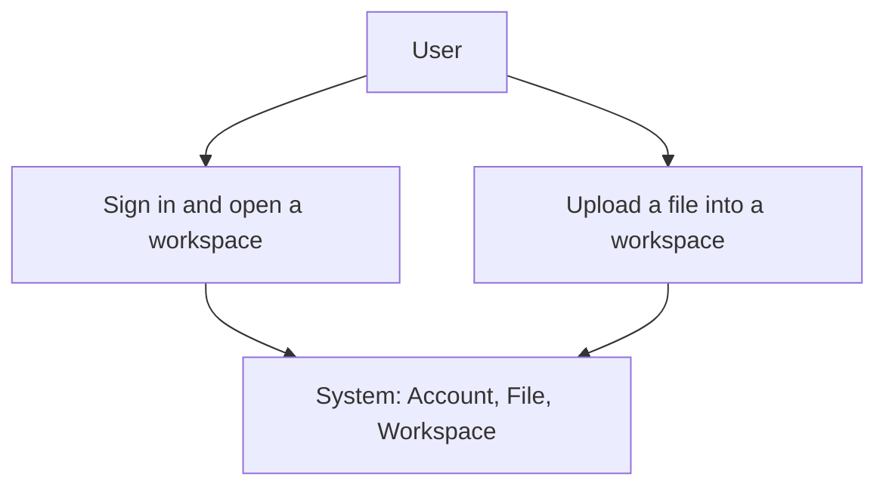

# Visual documentation and infographics (Phase 9)

Test Commander turns your committed workspace artifacts into diffable Mermaid
diagrams and a shareable infographic, then renders them to SVG/PNG. Every visual
is generated **only** from real artifacts, cites its sources, and never invents
a node, edge, or metric.

This walkthrough uses the bundled `seeded-visuals` fixture as a stand-in for a
real workspace. In your project, the same commands read your own
`product-knowledge/`, `traceability/`, `risk-register/`, `automation-plan/`, and
`quality-report/` artifacts.

## The flow

```
/tc:visualize            generate the full diagram set (visuals/mermaid/*.md)
/tc:generate-infographic generate the quality infographic (visuals/infographic/)
/tc:render-visuals       render Mermaid -> SVG/PNG (visuals/svg/, visuals/png/)
```

The `/tc:diagram-*` commands generate individual diagrams; `/tc:visualize` runs
them all.

## 1. Generate the diagrams

```
$ /tc:visualize
generated: 8 visual(s) under visuals/mermaid/
  .../visuals/mermaid/flow.md
  .../visuals/mermaid/sequence.md
  .../visuals/mermaid/state.md
  .../visuals/mermaid/architecture.md
  .../visuals/mermaid/risk.md
  .../visuals/mermaid/coverage.md
  .../visuals/mermaid/traceability.md
  .../visuals/mermaid/test-strategy.md
```

Each file is byte-stable Mermaid in a fenced block with a `> Sources:` footer.
For example, `visuals/mermaid/flow.md`:



> Sources: `product-knowledge/user-journeys.md`, `product-knowledge/system-model.md`

### The eight diagram types

| Command | Output | Drawn from |
| --- | --- | --- |
| `/tc:diagram-flow` | `flow.md` | user journeys + system entities |
| `/tc:diagram-sequence` | `sequence.md` | user journeys + system entities |
| `/tc:diagram-state` | `state.md` | the test map's result lifecycle |
| `/tc:diagram-architecture` | `architecture.md` | system-model entities |
| `/tc:diagram-risk` | `risk.md` | the risk register (severity groups) |
| `/tc:diagram-coverage` | `coverage.md` | the requirements map |
| `/tc:diagram-traceability` | `traceability.md` | the test map (full chain) |
| `/tc:diagram-test-strategy` | `test-strategy.md` | requirements + automation plan |

A command refuses (exit 2) when its source is missing or still a template stub,
and points you at the command that produces it. `/tc:visualize` skips a diagram
whose source is missing rather than failing the whole set.

## 2. Generate the infographic

```
$ /tc:generate-infographic
generated: 2 infographic file(s) under visuals/infographic/
  .../visuals/infographic/quality-brief.md
  .../visuals/infographic/quality-spec.md
```

`quality-brief.md` is a narrative with suggested panels; `quality-spec.md` is the
structured data block of the measured facts. Both carry only facts the quality
report states, and both cite the report:

```yaml
requirements: 3
latest_run: RUN-20260115-093000
passed: 1
failed: 1
flaky: 1
automated: 1
automatable: 4
risks: 4
open_questions: 1
evidence: 3
```

> Sources: `quality-report/current-quality-report.md`

## 3. Render to SVG/PNG

```
$ /tc:render-visuals
mermaid CLI (mmdc) not found; skipped rendering. Install it via 'make install'
(or 'npm install -g @mermaid-js/mermaid-cli').
```

`/tc:render-visuals` is the only command that shells out — to the Mermaid CLI
(`mmdc`, provisioned by `make install`). When `mmdc` is present it writes
`visuals/svg/<name>.svg` and `visuals/png/<name>.png` for every Mermaid source;
when it is absent it degrades gracefully, as above, so a missing CLI never
breaks your workflow.

## Where the visuals live

```
.test-commander/visuals/
  mermaid/        # the Mermaid source (.md, the source of truth)
  svg/            # rendered SVG
  png/            # rendered PNG
  infographic/    # the quality infographic brief + spec
```

The quality report links to the relevant visuals once they are generated, so
readers can jump from a metric to the diagram behind it.

## See also

- [Diagram standards](../../plugins/test-commander/skills/tc-visualize/methodology/diagram-standards.md)
- [Visual documentation methodology](../../plugins/test-commander/skills/tc-visualize/methodology/visual-documentation.md)
- [Infographic standards](../../plugins/test-commander/skills/tc-visualize/methodology/infographic-standards.md)
- [Command reference](../command-reference.md)
- [Workspace reference](../workspace-reference.md)
