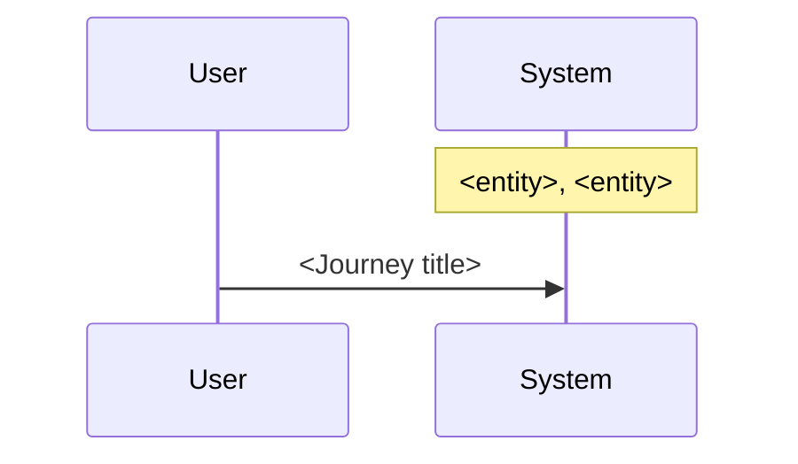

# User journey sequence

Sequence of the journeys the user initiates against the system. Generated by `/tc:diagram-sequence` from the knowledge base; each message is a journey named in its source.

> Sources: `product-knowledge/user-journeys.md`, `product-knowledge/system-model.md`
