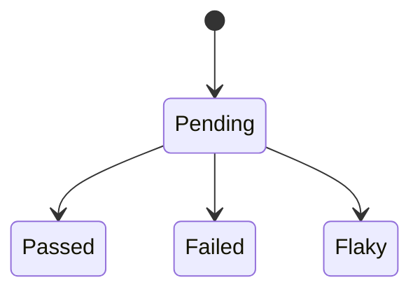

# Scenario result lifecycle

Scenario result lifecycle: the states a scenario's result moves through, drawn from the test map. Generated by `/tc:diagram-state`; only states present in the map are shown.

> Sources: `traceability/test-map.md`
